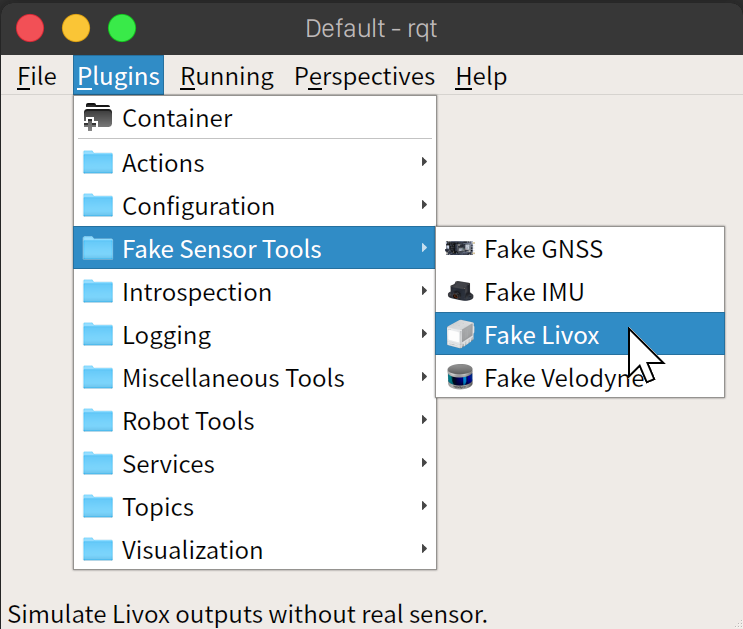
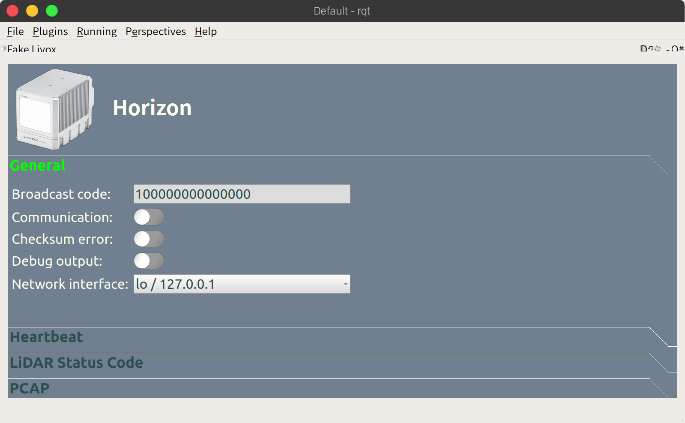
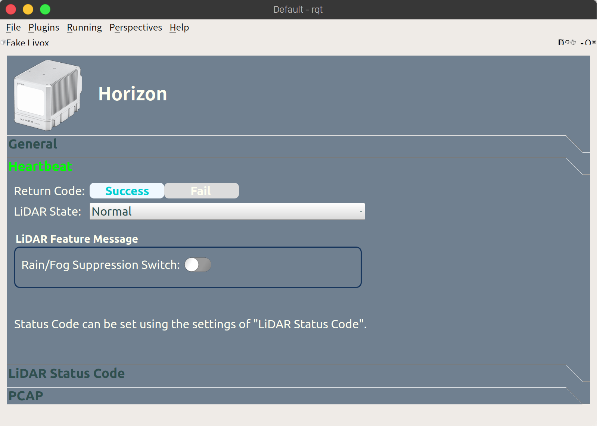
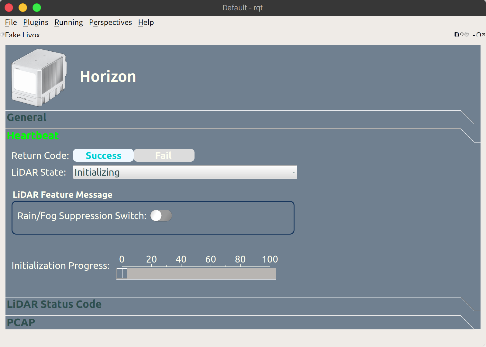
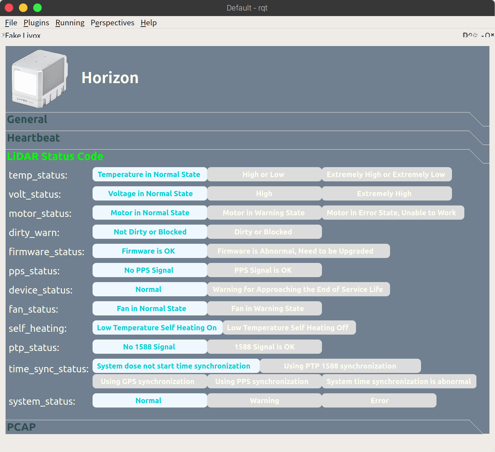

# Fake Livox for Autoware

## Instructions

1. Enable Fake Livox plugin.

- Choose from the menu: `Plugins`->`Fake Sensor Tools`->`Fake Livox`
  

2. Launch sensor driver.

```
rosrun sensor_monitor velodyne_monitor _ip_address:='localhost:8000'roslaunch src/autoware/launcher/sensing_launch/launch/livox_horizon.launch
```

3. Start communication with sensor driver.

- Specify any broadcast code in `Broadcast code` field.
- Then, turn on `Communication` switch to start communication with Livox ROS Driver.
  

Then transmission will be started.

---

## `General` page

| Field            | Description                   | Notes                                                          |
| ---------------- | ----------------------------- | -------------------------------------------------------------- |
| `Broadcast code` | Broadcast code                |                                                                |
| `Communication`  | Start/Stop communication      |                                                                |
| `Checksum error` | Enable/Disable checksum error | The checksum value will be set to `??` if enabled.             |
| `Debug output`   | Enable/Disable debug output   | Transmission data can be seen in a terminal window if enabled. |

---

## `Heartbeat` page



| Field                         | Description                 | Notes |
| ----------------------------- | --------------------------- | ----- |
| `Return Code`                 | Return Code                 |       |
| `LiDAR State`                 | LiDAR State                 |       |
| `Rain/Fog Suppression Switch` | Rain/Fog Suppression Switch |       |

### If LiDAR State is not `Initializing`

Status Code can be set using the settings of "Push Abnormal Status".

### If LiDAR State is `Initializing`



| Field                     | Description             | Notes |
| ------------------------- | ----------------------- | ----- |
| `Initialization Progress` | Initialization Progress |       |

---

## `Push Abnormal Status` page



| Field              | Description                       | Notes                                                                             |
| ------------------ | --------------------------------- | --------------------------------------------------------------------------------- |
| `temp_status`      | Temperature Status                |                                                                                   |
| `volt_status`      | Voltage Status of Internal Module |                                                                                   |
| `motor_status`     | Motor Status                      |                                                                                   |
| `dirty_warn`       | Dirty/Blocked Status              |                                                                                   |
| `firmware_status`  | Firmware Status                   |                                                                                   |
| `pps_status`       | PPS Status                        |                                                                                   |
| `device_status`    | Device SFantatus                  |                                                                                   |
| `fan_status`       | Motor Status                      |                                                                                   |
| `self_heating`     | Self Heating Status               |                                                                                   |
| `ptp_status`       | PTP Status                        |                                                                                   |
| `time_sync_status` | Time synchronization Status       |                                                                                   |
| `system_status`    | System Status                     | This code will be set automatically according to the settings of above errors.\*1 |

\*1 Also, please refer to the following document.

- [Livox SDK Communication Protocol](https://github.com/Livox-SDK/Livox-SDK/wiki/Livox-SDK-Communication-Protocol)

When the `system_status` is changed from 'Normal' to `Warning` or `Error`, the `Push Abnormal Status` message will be immediately transmitted at 10Hz.
